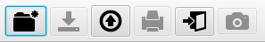
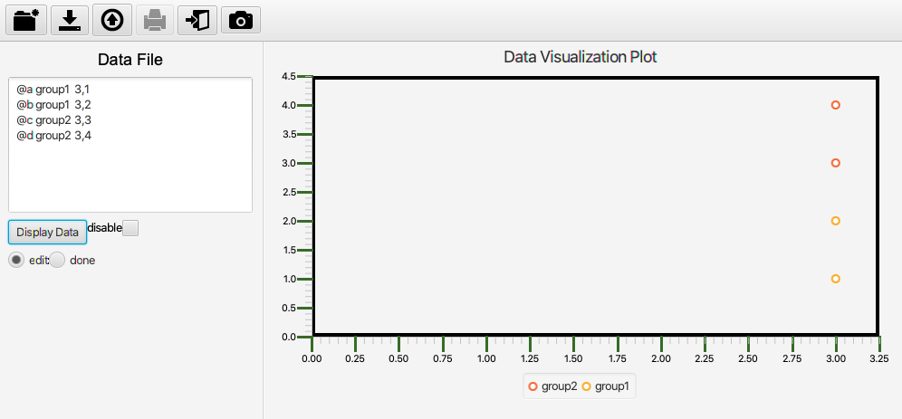
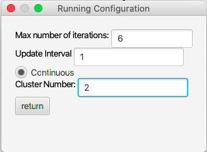

# DataVilij

<h2>Introduction</h2>
This is a data visualization app created in Spring 2018. DataViLiJ shows how algorithm works through the dynamic changes on the graph. Clustering and classifying algorithms were provided and used in this project. 

<h2>Instructions</h2>

The input is tab separated and can be typed or uploaded. To type, select the left-most button and to upload, select the third button from the left. The input must be tab separated with the format "@name group xCoordinate,yCoordinate" and each input is return separated. When handling multiple inputs, the name of each input must be unique, but the group and coordinates may overlap. Remember to press return after every input.

When the data is displayed on the graph, you may hover over the coordinate to see the name or you can use the legend to see the groupings. When you are happy with the data input, select done and you may continue to choose an algorithm of your choice. Make sure to customize your settings to provide the running configurations for the algorithm. The continuous option in the running configuration means that the graph will continuously update until it's complete. If this is not selected, you have to manually press "run" until it's complete. If at any point you want to take a screenshot of the graph or you want to exit the application, those functionalities are located on the toolbar.

<h2>Note</h2>
The base code, class structure, and the algorithms were provided by the professor as that was not the focus of the project. 

